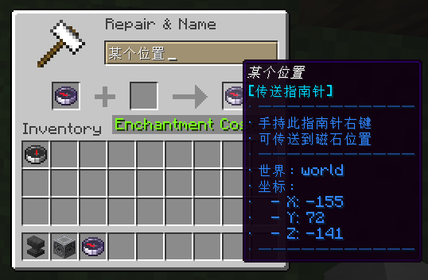

# CompassTeleport

使用指南针进行传送，增强原版指南针功能，更适合长途探险！



## 使用方法

1. 使用磁石绑定指南针；

2. 使用铁砧对指南针进行重命名；

3. 将命名后的指南针拿在手上；

4. 右键即可传送到磁石附近；

## 配置参考

```yaml
# 传送后的冷却时间 秒
cooldown-sec: 12

# 传送前的延迟时间 秒
delay-sec: 3

# 命名指南针的花费
cost-level: 1
```

## 权限节点

| 权限节点                | 说明   | 默认   |
|---------------------|------|------|
| compassteleport.use | 传送操作 | true |